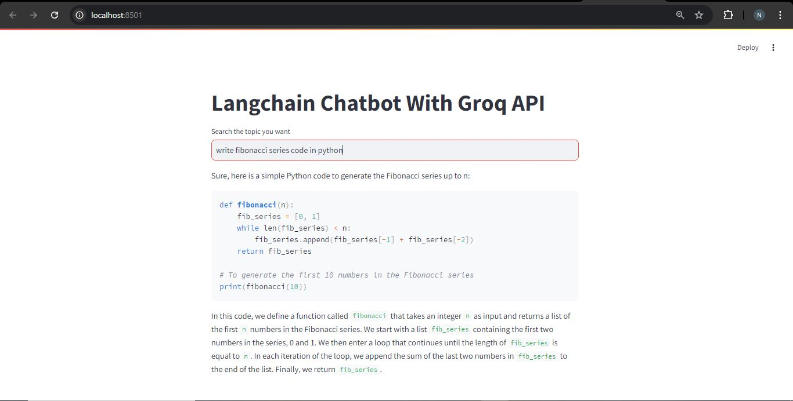
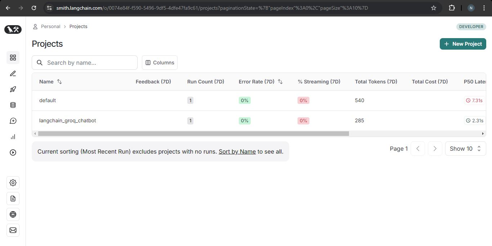

# Langchain Groq Chatbot

This project uses langchain with Groq LLM to implement a simple Chatbot. Langsmith is used for tracing and debugging.

## Chatbot Running

## Langsmith Dashboard

# Setup
- Create virtual environment:  `python -m venv venv`
- Activate virtual environment: `call venv/Scripts/activate.bat` in cmd
- Install dependencies: `pip install -r requirements.txt`
- Create environment variables `LANGCHAIN_API_KEY` and `GROQ_API_KEY`. You can get your langchain api key from [here](https://smith.langchain.com/), and your groq api key from [here](https://console.groq.com/keys).

# Libraries
- Streamlit
- Langchain
- Langchain Groq
- Python-Dotenv

## Contact
 - LinkedIn: [Natan Asrat](https://linkedin.com/in/natan-asrat)
 - Gmail: nathanyilmaasrat@gmail.com
 - Telegram: [Natan Asrat](https://t.me/fail_your_way_to_success)
 - Youtube: [Natville](https://www.youtube.com/@natvilletutor)

